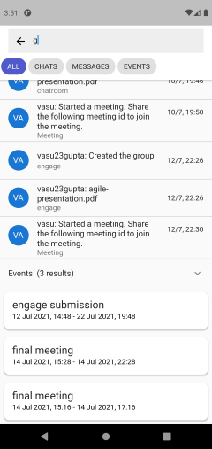

# Microsoft Teams clone which I made for Microsoft Engage 2021 mentorship program.

DEMO LINK: https://youtu.be/GxoqLromQJY

APK LINK: https://drive.google.com/file/d/1xJzIQ19ogx3gPqG4yEl4U5J7sduFoAkw/view?usp=sharing

## Features:
- Sign in and Register.
- Chat rooms with room name and icon.
- Add people to chat room and leave chat room.
- Group chat with text, image, file and location messages.
- Synchronised Calendar for all users and chat rooms.
- Create personal and team events.
- Application-wide search: search for chat messages, chat rooms and events.
- Group video call with hand raising, screen sharing, picture in picture mode, mute mic, disable video, switch between front and rear cameras.
- Cached images.
- Censorship: cleans english profanity in messages and prevents images containing explicit content to be sent in chat rooms where censorship is enabled.

## Screenshots
### Authenticate 

### Chat

### Calendar

### Search

### Video meeting

### Profile

More details about how each feature was implemented:

FRONT-END: The front end is a cross platform application made in Flutter, however only android is completely supported right now with many features also available on web.

BACKEND: The backend is made using Node.js, ExpressJS, MongoDB, mongoose, and it is hosted on heroku whereas the database is hosted on mongodb atlas.

AUTHENTICATION: Email and password authentication using google firebase.

CHAT: I've used socket.io to implement chat. I've also added support for media and location messages. Images are being stored in mongodb whereas files are being stored in firebase storage. Images are being cached in the application to reduce data usage.

VIDEO MEET: I've achieved the minimum functionality by using jitsi meet for video calling where I can group video call, share screen, raise hand and much more. While jitsi meet comes with a chat feature in video calls, it cannot be accessed before and after the meeting, so I've connected chat rooms with video calls so that chat can be started before the meeting and can remain forever, thereby completing the surprise feature.

CALENDAR: I've also added a synchronised calendar where users can create events either for themselves or for their teams.

SEARCH: A search feature is also added which can search for chat rooms, chat messages (text messages and file messages' names only) and events. A search is performed by making a regular expression from the user's query and then using mongodb's find function.

CENSORSHIP: An additional feature which cleans english profanity in messages and prevents images containing explicit content to be sent in chat rooms where censorship is enabled. Images are filtered using deepai's nsfw detector api.
